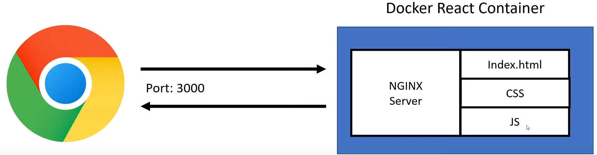

# Docker + ReactJS

## Docker Commands

### Docker Image

`docker build -t <image-name> .` <!--<.> is for current directory-->

### Docker Container

Run docker container \
`docker run -d -p 3000:3000 --name <container-name> <image-name>`

*Sync app folder with container app folder, using Volume:* \
`docker run -v <dirLocalDirectoryPath:containerDirectoryPath> -d -p 3000:3000 --name <container-name> <image-name>` \
*Sync app folder with container app folder, using Volume and readonly:* \
`docker run -v <dirLocalDirectoryPath:containerDirectoryPath:ro> -d -p 3000:3000 --name <container-name> <image-name>` \
*example using Powershell:* \
`docker run -v ${pwd}\src:/app/src -d -p 3000:3000 --name <container-name> <image-name>` \
*example using CMD:* \
`docker run -v %cd%\src:/app/src -d -p 3000:3000 --name <container-name> <image-name>` \
*example using Windows Environment:* 
- `docker run -v %cd%\src:/app/src -e CHOKIDAR_USEPOLLING=true -d -p 3000:3000 --name <container-name> <image-name>` 

- `docker run -v %cd%\src:/app/src -e CHOKIDAR_USEPOLLING=true -e REACT_APP_NAME=reactApp1 -d -p 3000:3000 --name <container-name> <image-name>` 

- Using an env file: `docker run -v %cd%\src:/app/src -env-file ./.env -d -p 3000:3000 --name <container-name> <image-name>` 

*example using Linux:* \
`docker run -v $(pwd)/src:/app/src -d -p 3000:3000 --name <container-name> <image-name>` 

Interact with container: \
`docker exec -it <container-name> bash`

### Docker-Compose
docker-compose versioning reference at [Web site](https://docs.docker.com/compose/compose-file/compose-versioning/). \
For command help: \
`docker-compose --help`. \
`docker-compose up --help`.

Managing docker-compose services:
- `docker-compose up`
- `docker-compose up -d`\
**Note: docker-compose up won't re-create the docker image**
- `docker-compose up -d --build`
- `docker-compose down`

## Docker for Production
### Create Image
`docker build Dockerfile.prod -t docker-image-prod .`

### Create Container
`docker run --env-file ./.env -d -p 8080:80 --name react-app-prod react-image-prod`

## Diagram
